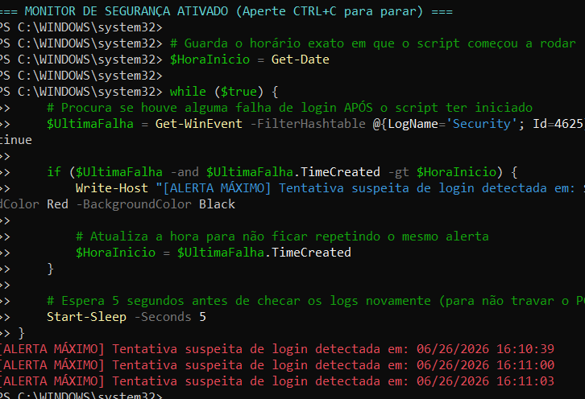

Markdown
# 🛡️ Threat Hunting Basics: Caçando Falhas de Logon com PowerShell


Este repositório documenta um laboratório prático de auditoria de segurança e *Threat Hunting* focado na análise de logs de eventos do ecossistema Windows utilizando o PowerShell.

---

## 📋 Cenário e Objetivo

O objetivo deste projeto foi simular e identificar uma das técnicas mais comuns de ataque de vetor de acesso: o **Ataque de Força Bruta (Brute Force)** ou tentativas de login não autorizadas. 

Utilizando o PowerShell, foi realizada uma extração cirúrgica do **Log de Segurança do Windows** para identificar falhas de autenticação, mapeando quem tentou acessar a máquina, quando e de onde veio a tentativa.

---

## 🛠️ Tecnologias e Comandos Utilizados

*   **Ambiente:** Windows 10/11 / Windows Server (PowerShell em modo Administrador)
*   **Mecanismo:** Windows Event Viewer (Visualizador de Eventos)
*   **Comando Principal:** `Get-WinEvent`

---

## 🚀 Passo a Passo do Laboratório

### 1. Simulação do Alerta
Para gerar uma evidência real no sistema, a tela do Windows foi bloqueada (`Win + L`) e foram realizadas tentativas intencionais de logon com credenciais incorretas, gerando o **ID de Evento 4625** (Falha de Logon).

### 2. Coleta e Filtragem dos Dados
Para extrair os eventos gerados sem sobrecarregar a memória, utilizamos uma tabela de filtragem (*Hashtable*), que é a prática recomendada em auditorias reais por ser extremamente performática:

```powershell
# Extrai o último evento de falha de logon gerado no sistema
Get-WinEvent -FilterHashtable @{LogName='Security'; Id=4625} -MaxEvents 1 | Format-List TimeCreated, Message
```
---
### 🤖 Evolução: Automação e Monitoramento em Tempo Real (Mini-SIEM)
Após dominar a busca manual pelos logs, o projeto foi evoluído para um modelo de monitoramento contínuo. Foi desenvolvido um script em PowerShell que roda em loop, atuando como um "Mini-SIEM" local.

Código de Monitoramento Contínuo
O script abaixo monitora o sistema a cada 5 segundos e dispara um alerta visual vermelho na tela assim que um evento 4625 (Falha de Logon) é gerado, capturando o ataque no momento exato em que ele acontece:

```PowerShell
Write-Host "=== MONITOR DE SEGURANÇA ATIVADO ===" -ForegroundColor Cyan
$HoraInicio = Get-Date

while ($true) {
    $UltimaFalha = Get-WinEvent -FilterHashtable @{LogName='Security'; Id=4625} -MaxEvents 1 -ErrorAction SilentlyContinue

    if ($UltimaFalha -and $UltimaFalha.TimeCreated -gt $HoraInicio) {
        Write-Host "[ALERTA MÁXIMO] Tentativa suspeita de login detectada em: $($UltimaFalha.TimeCreated)" -ForegroundColor Red -BackgroundColor Black
        $HoraInicio = $UltimaFalha.TimeCreated
    }
    Start-Sleep -Seconds 5
}
```
### 🧠 Conceitos de Cibersegurança Aplicados
Event ID 4625 (Anatomia do Log): Este ID é gerado nativamente pelo Windows toda vez que uma tentativa de autenticação falha. Ele registra dados cruciais para investigações forenses, como o nome da conta utilizada, o tipo de logon (local ou remoto) e, em muitos casos, o IP de origem da tentativa.

Filtragem Eficiente em SecOps: O uso de -FilterHashtable executa a filtragem do lado do provedor de logs do Windows, evitando o uso ineficiente de memória que ocorreria ao trazer milhares de logs para o console através de um pipeline com Where-Object.

Lógica de Correlação Proativa: A evolução para o monitoramento em loop simula o comportamento básico de um agente de SIEM, que analisa logs de forma contínua para reduzir o tempo de detecção (Mean Time to Detect - MTTD).

Aviso Legal: Este laboratório foi executado em ambiente estritamente local e controlado para fins didáticos de auditoria e segurança da informação.

### 🎯 Validação Prática em Laboratório
Abaixo está o registro visual do script em execução, demonstrando a captura em tempo real das tentativas de logon com falha simuladas no ambiente de testes:


